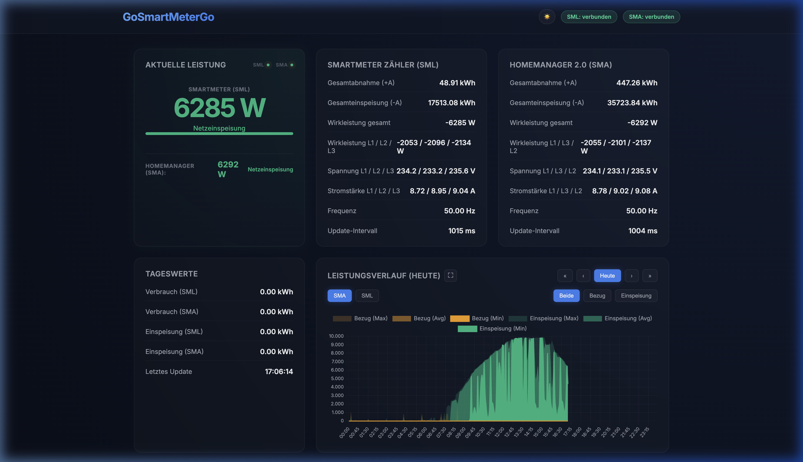
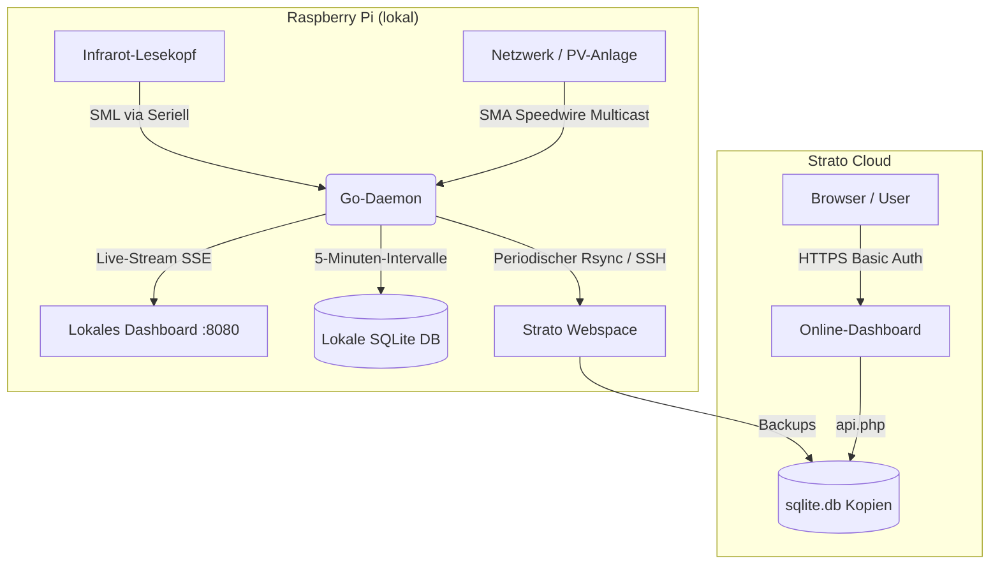

# GoSmartMeterGo

*GoSmartMeterGo* ist ein in Go geschriebenes Tool zur Erfassung, Archivierung und Visualisierung von Stromverbrauchs- und Stromeinspeisungsdaten auf dem Raspberry Pi.

---

## Funktionsweise

Das Tool liest und kombiniert zwei Datenquellen:
1.  **SmartMeter (SML):** Liest die Zählerstände (Bezug und Einspeisung) des Stromzählers über einen optischen Auslesekopf per seriellem SML-Protokoll (Smart Message Language).
2.  **SMA HomeManager (Speedwire):** Lauscht im lokalen Netzwerk auf die per Multicast (UDP Speedwire-Protokoll) gesendeten Leistungsdaten des SMA HomeManagers.

---

## Systemarchitektur

Das Projekt teilt sich in ein lokales Erfassungssystem auf dem Raspberry Pi und eine optionale Bereitstellung auf einem Strato-Webspace auf:

---

## Features

*   **Echtzeit-Erfassung & lokales Dashboard:** Lokaler Webserver, der die Live-Daten per Server-Sent Events (SSE) direkt im Browser anzeigt.
*   **Historie & Auswertung:** Die Messdaten werden alle 5 Minuten aggregiert in einer **SQLite-Datenbank** gespeichert, um Tages-, Wochen-, Monats- und Jahresstatistiken darzustellen.
*   **Telegram-Benachrichtigungen:**
    *   **Watchdog:** Benachrichtigung per Telegram-Bot, falls der SMA HomeManager keine Daten mehr sendet.
    *   **Tagesbericht:** Täglicher Bericht über den Verbrauch und die Einspeisung des Vortages.
*   **Strato-Backup & Online-Viewer:**
    Die SQLite-Datenbank wird per `rsync` (über SSH) in konfigurierbaren Intervallen (oder manuell) auf einen Strato-Webspace geladen. Ein PHP-Skript auf Strato liest die Datenbank aus, wodurch das Dashboard auch von unterwegs aus (per Passwort geschützt) aufgerufen werden kann.

---

## Technische Details

*   **Programmiersprache:** Go (Golang) für das Backend, HTML/CSS/JS für das Dashboard.
*   **Datenbank:** SQLite für die lokale Speicherung.
*   **Deployment:** Kann über ein Makefile als Debian-Paket (`.deb`) gebaut und als systemd-Service auf dem Raspberry Pi installiert werden.
