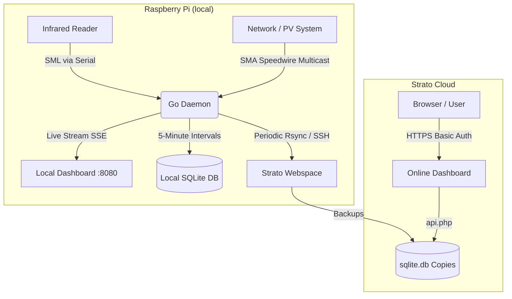

**WORK IN PROGRESS.** Private test project

Code (and READMEs) from AI, will be checked and maybe adjusted.

TODO: Check AI code for correctness and security.

---

# GoSmartMeterGo

*GoSmartMeterGo* is a tool written in Go to collect, archive, and visualize electricity consumption and feed-in data on a Raspberry Pi.

---

## How it works

The tool reads and combines two data sources:
1.  **SmartMeter (SML):** Reads the meter index (import and export) of the electricity meter via an optical reading head using the serial SML protocol (Smart Message Language).
2.  **SMA HomeManager (Speedwire):** Listens on the local network for SMA HomeManager multicast packets (UDP Speedwire protocol).

---

## System Architecture

The project is split into a local collection daemon on the Raspberry Pi and an optional deployment on a Strato webspace:

---

## Features

*   **Real-time Monitoring & Local Dashboard:** A local web server that displays live data in your browser using Server-Sent Events (SSE).
*   **History & Reports:** Metrics are aggregated every 5 minutes and stored in a **SQLite database** to generate daily, weekly, monthly, and yearly statistics.
*   **Telegram Notifications:**
    *   **Watchdog:** Sends alerts via a Telegram bot if the SMA HomeManager stops broadcasting data.
    *   **Daily Report:** Daily summary of the previous day's consumption and feed-in.
*   **Strato Backup & Online Viewer:**
    The SQLite database is uploaded to a Strato webspace at configurable intervals (or manually) using `rsync` (via SSH). A PHP script on Strato reads the database, allowing password-protected dashboard access on the go.

---

## Technical Details

*   **Programming Languages:** Go (Golang) for the backend, HTML/CSS/JS for the dashboard.
*   **Database:** SQLite for local storage.
*   **Deployment:** Can be built as a Debian package (`.deb`) using a Makefile and installed as a systemd service on the Raspberry Pi.
